#  CHIKK Shopping App (Flutter)

A modern fashion shopping mobile application UI built using Flutter.  
This project focuses on creating a clean, responsive, and visually appealing user interface inspired by a Figma prototype.

---

##  Features

- Glassmorphism UI design
- Fully responsive layouts
- Wishlist functionality
- Cart management system
- Product details screen
- Login & Registration UI

---

## Figma Design

This UI was designed using Figma before development. You can view it from below link.

  

  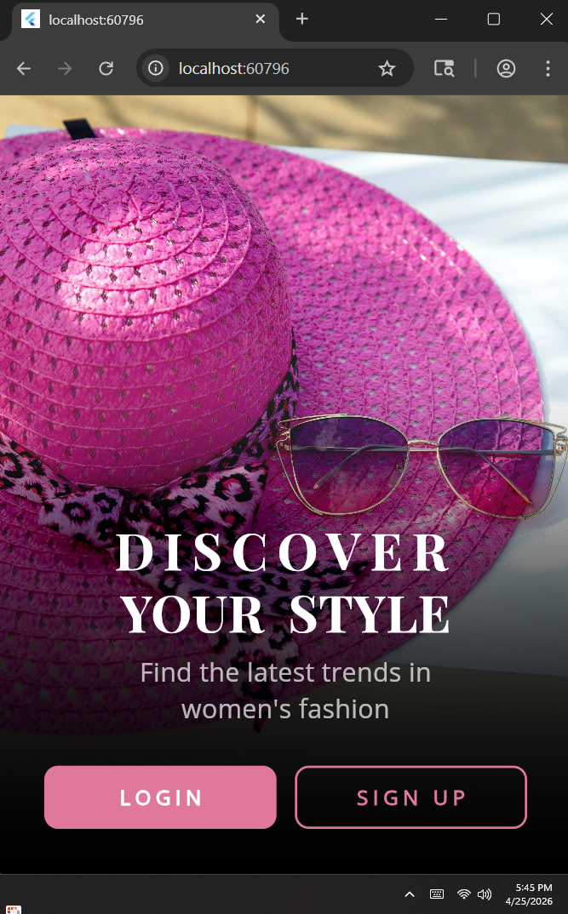
  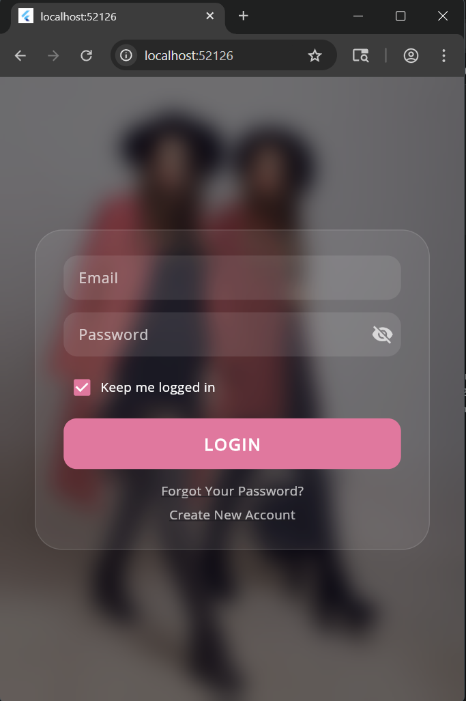
  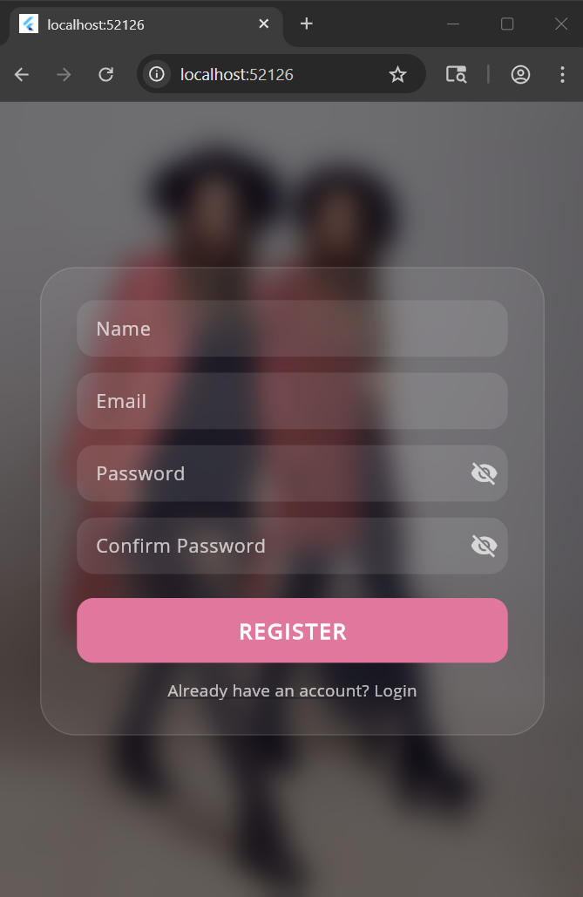

  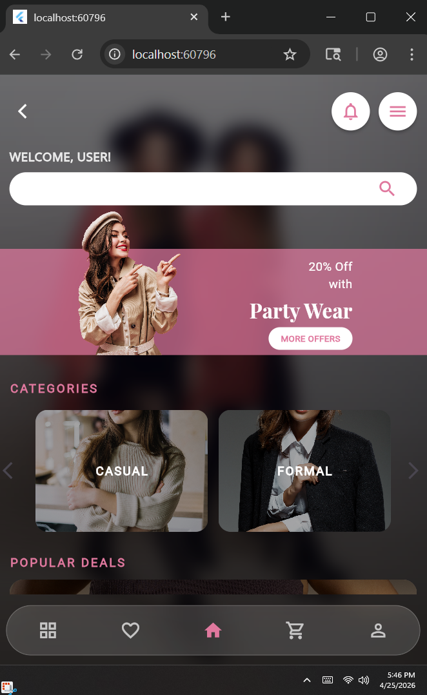
  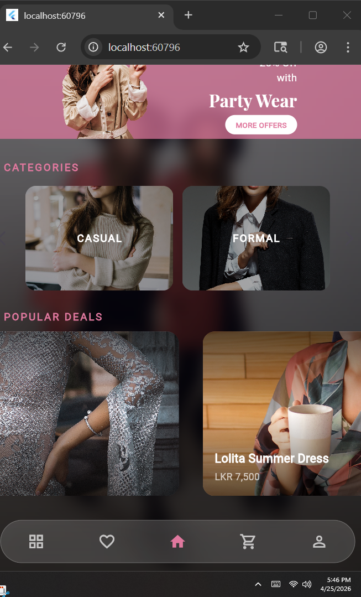
  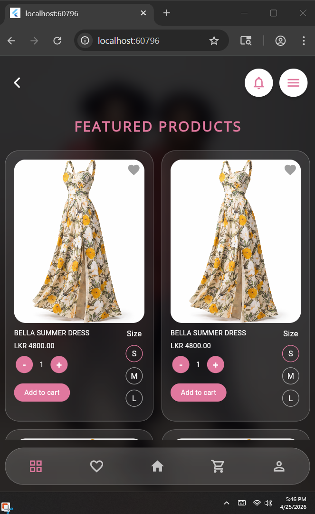

  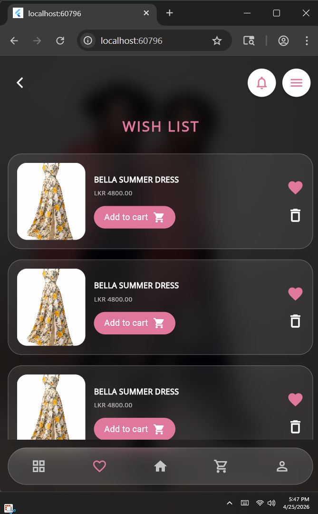
  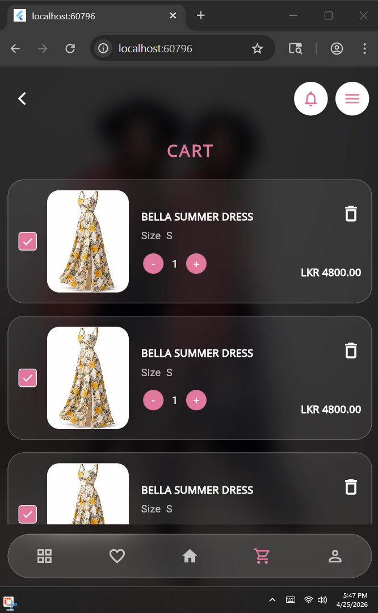
  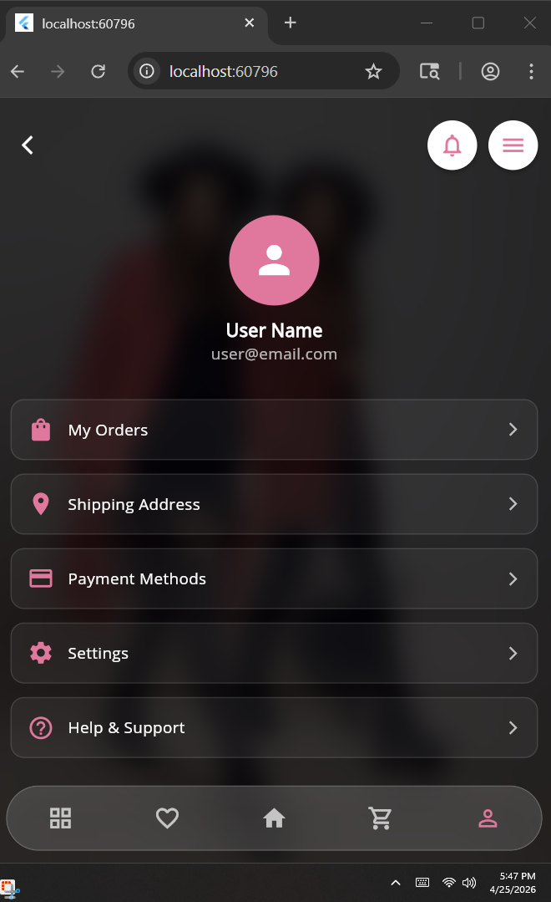

  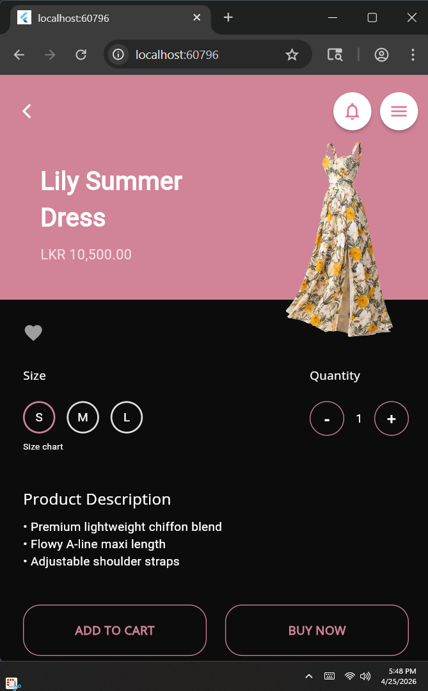
  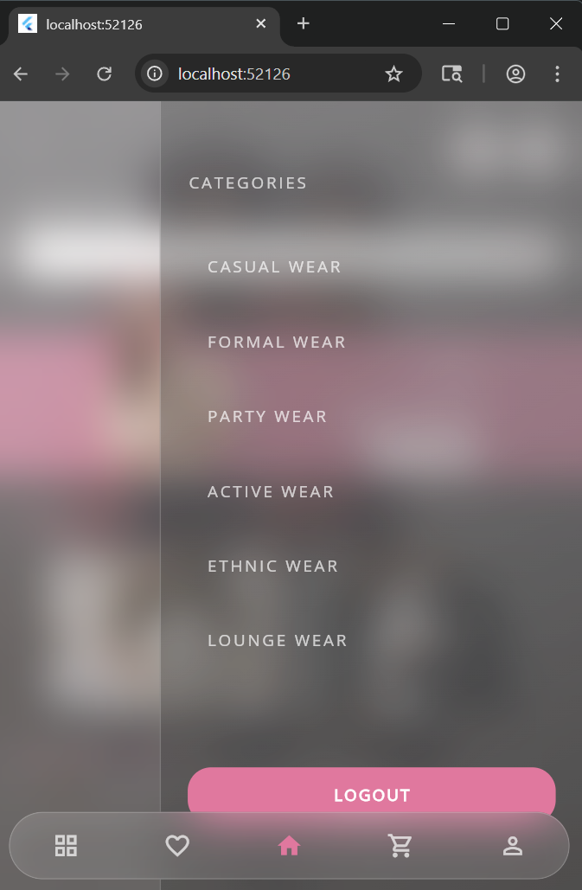
  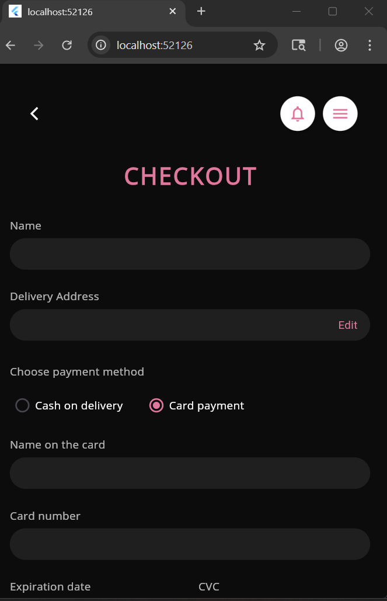
  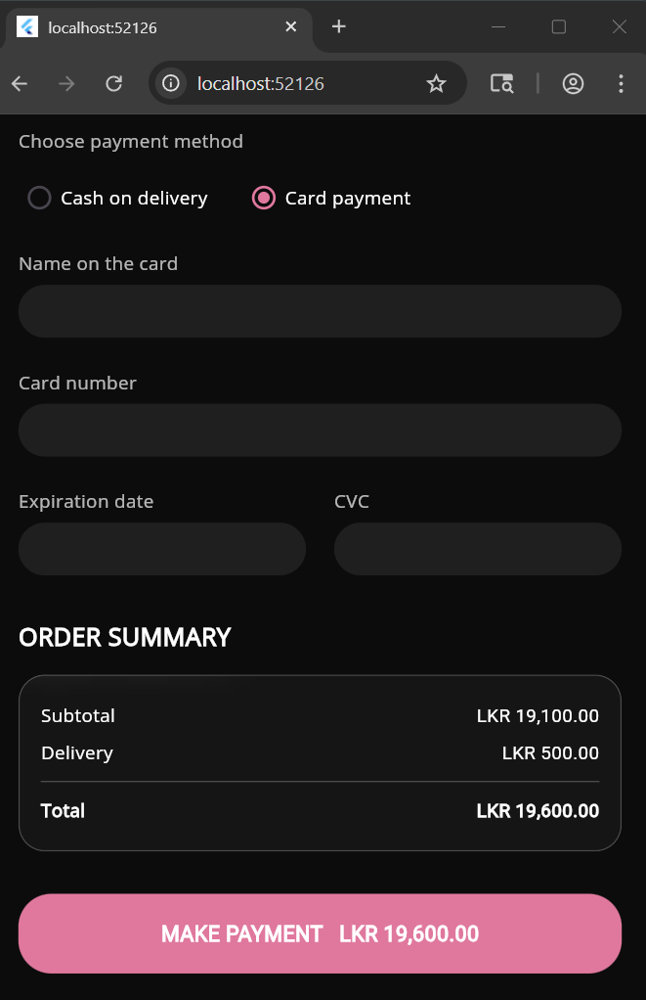

##  Technologies Used

- Flutter
- Dart
